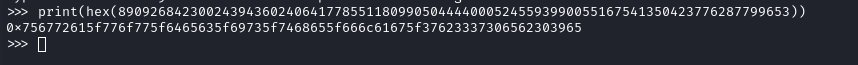
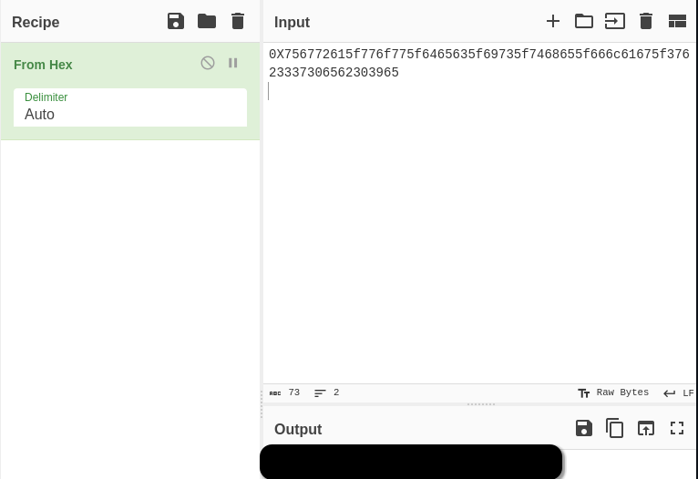

По заданию нам дается строка ("890926842300243943602406417785511809905044440005245593990055167541350423776287799653"), переводим эту integer-строку в hex;

Далее декодируем из hex'ов и получаем флаг: *deleted*

